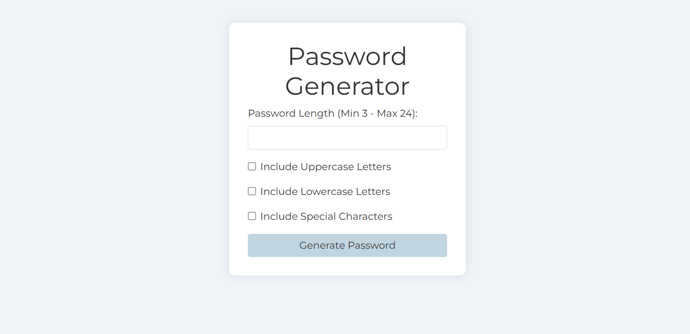
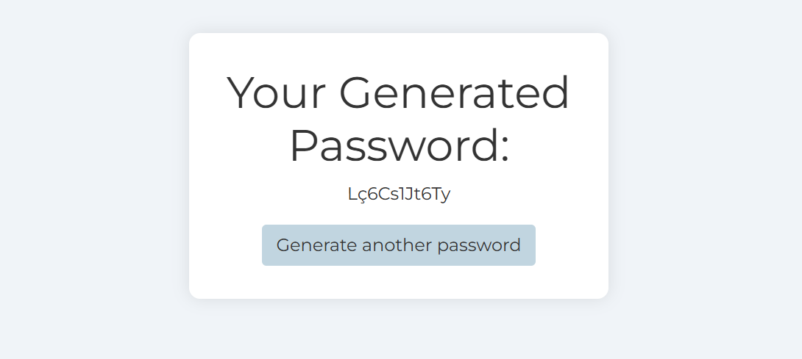

# Password Generator

This project is a Spring Boot web application that generates random passwords based on user-specified criteria. Users can specify the length of the password and choose whether to include uppercase letters, lowercase letters, and special characters.


## Technologies Used

- Java
- Spring Boot
- Thymeleaf
- Bootstrap

## Getting Started

### Prerequisites

- Java 8 or later
- Maven
- An IDE or text editor of your choice

### Installation

1. Clone the repository:

   ```bash
   git clone https://github.com/byurudur/PasswordGenerator.git
   cd PasswordGenerator
    ```
2. Clone the project with Maven:
   ```bash
   mvn clean install
    ```
3. Run the application:
   ```bash
   mvn spring-boot:run
    ```
4. Open your web browser and navigate to 'http://localhost:8080'.

# Password Generator

This project is a Spring Boot web application that generates random passwords based on user-specified criteria. Users can specify the length of the password and choose whether to include uppercase letters, lowercase letters, and special characters.

## Usage

1. Navigate to the home page.
2. Enter the desired password length (between 3 and 24).
3. Select the criteria for your password:
   - Include Uppercase Letters
   - Include Lowercase Letters
   - Include Special Characters
4. Click the "Generate Password" button.
5. The generated password will be displayed on the result page.

## Screenshots

- **Home Page**
  

- **Result Page**
  

## License

This project is licensed under the MIT License. See the [LICENSE](LICENSE) file for details.

## Contribution

Contributions to this project are welcome! If you would like to contribute, please follow these steps:

1. Fork the repository.
2. Create a new branch (`git checkout -b feature/new-feature`).
3. Make your changes.
4. Commit your changes (`git commit -am 'Add new feature'`).
5. Push to the branch (`git push origin feature/new-feature`).
6. Create a new Pull Request.

Please ensure that your Pull Request adheres to the project's coding standards and includes tests if applicable. Thank you for contributing!
